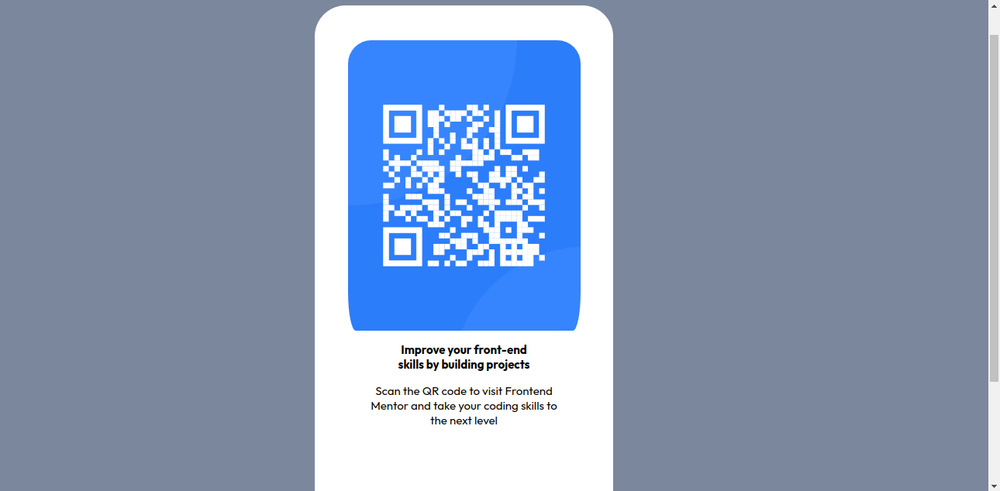

# Frontend Mentor - QR code component solution

This is a solution to the [QR code component challenge on Frontend Mentor](https://www.frontendmentor.io/challenges/qr-code-component-iux_sIO_H). Frontend Mentor challenges help you improve your coding skills by building realistic projects. 

## Table of contents

- [Overview](#overview)
  - [Screenshot](#screenshot)
  - [Links](#links)
- [My process](#my-process)
  - [Built with](#built-with)
  - [What I learned](#what-i-learned)
  - [Continued development](#continued-development)
  - [Useful resources](#useful-resources)
- [Author](#author)


## Overview

### Screenshot




### Links

- Solution URL:https://github.com/Mel-ca/frontend-QRscanner


## My process

### Built with

- Semantic HTML5 markup
- CSS custom properties
- Flexbox
- CSS Grid
- Mobile-first workflow

**Note: These are just examples. Delete this note and replace the list above with your own choices**

### What I learned

I learned how to create a QR code component using HTML and CSS. I used CSS Grid and Flexbox to style the component and position the QR code image. Additionally, I gained experience in working with images and optimizing them for web use.


```html
<body>
    <div class="phone">
      
      <p class="phone-text">Improve your front-end <br> skills by building projects</p>
      <p class="sub-text">Scan the QR code to visit Frontend <br>Mentor and take your coding skills to<br>the next level</p>
    </div>
  </body>
```
```css
.phone {
      width: 100%;
      max-width: 375px;
      height: calc(375px * 2);
      margin-top: 50px;
      margin-bottom: 50px;
      margin-left: 400px;
      border-top-left-radius: 40px;
      border-top-right-radius: 40px;
      border-bottom-left-radius: 40px;
      border-bottom-right-radius: 40px;
      border: 5px solid white;
      overflow: hidden;
      background-color: white;
    }


### Continued development

I plan to continue learning more about CSS Grid and Flexbox and how to use them to create complex layouts. I also want to improve my knowledge of React and explore more advanced topics like state management and Redux.

### Useful resources

-MDN Web Docs - This helped me learn about CSS Grid and how to use it to create layouts.
-Styled Components documentation - This documentation helped me learn how to use styled-components to style my React components.

## Author


- Frontend Mentor - [@Mel-ca](https://www.frontendmentor.io/profile/Mel-ca)
- Twitter - [@melonielangat](https://www.twitter.com/melonielangat)


